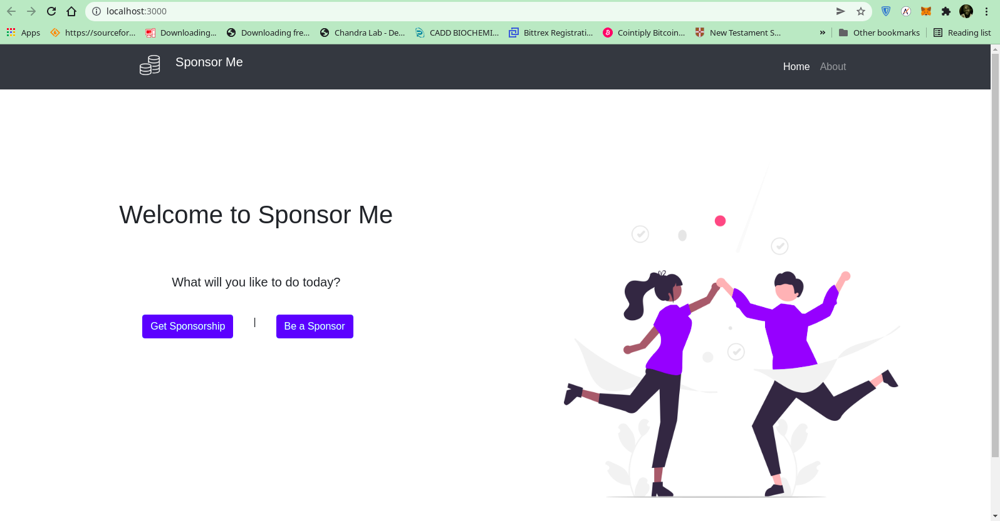

# SponsorMe


A Blockchain Project built during the Umoja bounty hack.
With [Reach lang](https://github.com/reach-sh/reach-lang) - the domain-specific language for trustworthy DApps, and react

To run: 
```
$ cd into the sponsor folder
$ yarn install
$ the yarn start
```

By [Joseph](https://github.com/adujoseph) and [David](https://github.com/onyedikachi-david)

Picture Speaks:



Link to tutorial: 

Link to Demo:
